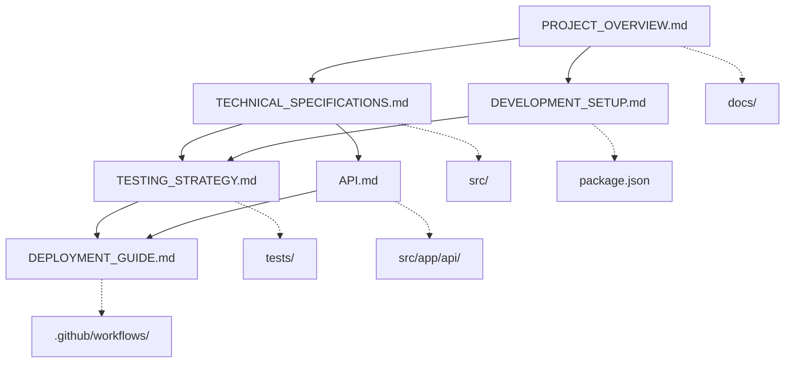

# ドキュメント管理インデックス

## プロジェクト情報管理システム

AI駆動手首・母指可動域リハビリテーションアプリの包括的な情報管理を目的とした、構造化されたMarkdownドキュメントシステムです。

## ドキュメント構造

### 📋 1. プロジェクト概要

**ファイル**: [`PROJECT_OVERVIEW.md`](./PROJECT_OVERVIEW.md)

- プロジェクトの目的と背景
- 機能仕様と技術的特徴
- 開発ステータスと進捗状況
- 今後の展望とロードマップ

### 🔧 2. 技術仕様書

**ファイル**: [`TECHNICAL_SPECIFICATIONS.md`](./TECHNICAL_SPECIFICATIONS.md)

- システムアーキテクチャ
- MediaPipe統合とカメラ制御
- 角度計算アルゴリズム
- データベース設計
- 状態管理とコンポーネント設計

### 🚀 3. 開発環境構築

**ファイル**: [`DEVELOPMENT_SETUP.md`](./DEVELOPMENT_SETUP.md)

- 環境要件と依存関係
- インストール手順
- 開発用コマンド一覧
- トラブルシューティング

### 🧪 4. テスト戦略

**ファイル**: [`TESTING_STRATEGY.md`](./TESTING_STRATEGY.md)

- テストピラミッドと戦略
- ユニット・統合・E2Eテスト
- MediaPipe統合テスト
- 品質保証と医療機器認証対応

### 📦 5. デプロイメントガイド

**ファイル**: [`DEPLOYMENT_GUIDE.md`](./DEPLOYMENT_GUIDE.md)

- CI/CDパイプライン
- Vercel環境設定
- PWA最適化
- セキュリティとモニタリング

### 🔌 6. API仕様書

**ファイル**: [`API.md`](./API.md)

- RESTful API設計
- エンドポイント仕様
- データモデル定義
- 認証・セキュリティ

## ドキュメント相互関係



## 更新・保守方針

### 🔄 定期更新サイクル

| ドキュメント                | 更新頻度     | トリガー           |
| --------------------------- | ------------ | ------------------ |
| PROJECT_OVERVIEW.md         | 月次         | 機能追加・仕様変更 |
| TECHNICAL_SPECIFICATIONS.md | 随時         | アーキテクチャ変更 |
| DEVELOPMENT_SETUP.md        | 随時         | 環境要件変更       |
| TESTING_STRATEGY.md         | スプリント毎 | テスト戦略見直し   |
| DEPLOYMENT_GUIDE.md         | 随時         | インフラ変更       |
| API.md                      | 随時         | API仕様変更        |

### 📝 更新ルール

1. **変更追跡**: Git履歴で変更を追跡
2. **バージョン管理**: セマンティックバージョニング準拠
3. **レビュー**: 主要変更は複数メンバーレビュー必須
4. **統合性**: 関連ドキュメント間の整合性確保

### 🎯 品質基準

- **完全性**: 新規参加者が理解できる詳細度
- **正確性**: 実装との乖離ゼロ
- **可読性**: Markdownベストプラクティス準拠
- **検索性**: 適切なヘッダー構造とキーワード

## 使用方法

### 👥 開発者向け

```bash
# ドキュメント全体の確認
find docs/ -name "*.md" -exec echo "=== {} ===" \; -exec head -10 {} \;

# 特定トピック検索
grep -r "MediaPipe" docs/

# ドキュメント更新時のチェック
markdownlint docs/
```

### 🏥 ステークホルダー向け

1. **プロジェクト理解**: `PROJECT_OVERVIEW.md` → `TECHNICAL_SPECIFICATIONS.md`
2. **開発参加**: `DEVELOPMENT_SETUP.md` → `TESTING_STRATEGY.md`
3. **運用準備**: `DEPLOYMENT_GUIDE.md` → `API.md`

### 📱 医療従事者向け

- **機能確認**: `PROJECT_OVERVIEW.md` の機能仕様セクション
- **精度情報**: `TECHNICAL_SPECIFICATIONS.md` の角度計算精度
- **品質保証**: `TESTING_STRATEGY.md` の医療機器品質基準

## 継続的改善

### 📊 メトリクス

- ドキュメント参照頻度
- 新規開発者のオンボーディング時間
- 技術仕様と実装の乖離件数
- ユーザーフィードバック満足度

### 🔍 定期見直し項目

- [ ] 実装とドキュメントの同期確認
- [ ] 新技術・ライブラリ更新反映
- [ ] ユーザビリティ改善提案
- [ ] 医療機器認証要件対応状況

## 関連リソース

### 📚 外部参照

- [MediaPipe Hands公式ドキュメント](https://developers.google.com/mediapipe/solutions/vision/hand_landmarker)
- [Next.js 14公式ガイド](https://nextjs.org/docs)
- [医療機器プログラム規制ガイダンス](https://www.pmda.go.jp/)

### 🛠️ 開発ツール

- [Markdown Preview Enhanced](https://marketplace.visualstudio.com/items?itemName=shd101wyy.markdown-preview-enhanced)
- [markdownlint](https://github.com/DavidAnson/markdownlint)
- [Mermaid Live Editor](https://mermaid.live/)

---

_このドキュメント管理システムにより、プロジェクト情報の一元化と継続的な品質向上を実現します。_
